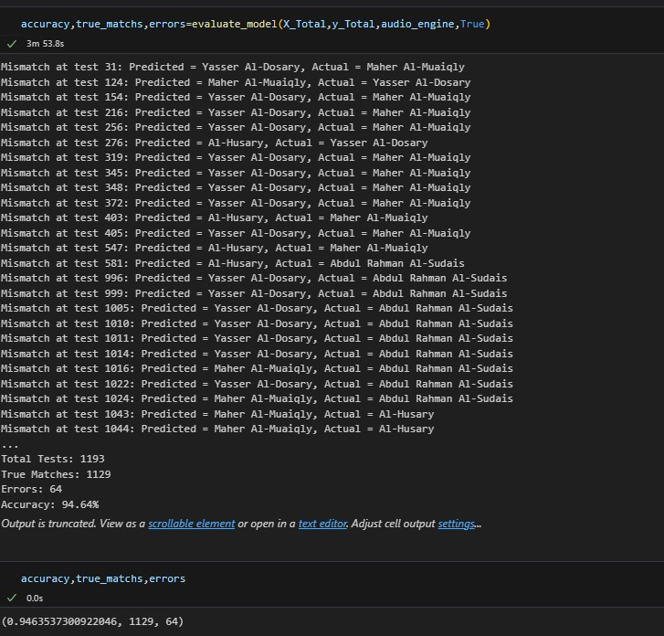

# 🎵 Audio Similarity Search: Intelligent Quran Reciter Identification

## 🎓 Graduation Project Context

This project is the **AI-powered Reciter Identification component** of our Graduation Project: an innovative mobile application that merges deep technology with spiritual depth, enabling users to interact with the Quran in intelligent and meaningful ways.

### 📱 The Complete App Features:

**🧠 Two AI-Powered Models:**
1. **Reciter Identification Model** (94.64% accuracy) - *This Repository*
   - Uses OpenL3 audio embeddings + Pinecone Vector DB similarity search
   - Detects the reciter's voice from any Quranic audio
   
2. **Surah & Verse Recognition Model** (96.0% accuracy)
   - Built with Whisper (Arabic STT) + BERT for verse vectorization
   - Returns the exact Surah and verse recited
   - Bonus: Provides transcription for text-based comparison with Quran verses

**🕋 Islamic Tools and Features:**
- Full Mushaf with verse highlighting, bookmarking, and navigation (Juz', Hizb, Surah)
- Multi-reciter playback with accurately timed segments
- Multi-part search of verses
- Location-based prayer times & Qibla direction
- Sebha (Tasbeeh Counter)
- Daily Azkar, reminders, and Tafsir

---

## 🎯 Focus of This Repository: Reciter Identification AI

This repository specifically showcases the **Reciter Identification Model** - an advanced machine learning system that **identifies Quran reciters with 94.64% accuracy** using deep learning and semantic audio search. This component demonstrates the power of combining neural audio embeddings (OpenL3) with scalable vector databases (Pinecone) to solve real-world audio identification challenges.

> **Real-World Problem**: How can we automatically identify which reciter is reciting a Quranic verse from audio alone, even in noisy conditions?  
> **Solution**: Transform audio into semantic embeddings and find the most similar voice in a database of 4,960+ recitation clips.

## 🎬 Live Demo & Proof of Work

**🔴 [Watch the Complete Demo on LinkedIn](https://www.linkedin.com/posts/ahmed-khater-332121259_flutter-ai-graduationproject-activity-7342690710879461376-uRSh?utm_source=social_share_send&utm_medium=member_desktop_web)**

See the system in action! This video demonstration showcases:
- Real-time reciter identification from audio input
- The complete workflow from audio upload to results
- Mobile application integration (Flutter)
- Actual performance on real Quran recitations
- User interface and system responsiveness

> 📌 **Important**: This demo serves as official documentation and proof of the working system, demonstrating real-world application beyond the theoretical implementation.

## 🎯 What Does This System Do?

Imagine you hear a Quran recitation and want to know which Sheikh is reciting - this system does exactly that:

1. **Upload any Quran recitation audio** (clean or noisy)
2. **Instantly identifies the reciter** from a database of 4 prominent reciters
3. **Returns confidence scores** and similar recitation examples
4. **Works robustly** even with background noise and recording quality variations

### Key Achievement
✅ **94.64% accuracy** on 1,193 real-world test queries  
✅ **Sub-second query time** for instant identification  
✅ **Noise-robust** design handles real-world audio conditions

## 📋 Table of Contents

- [Live Demo & Proof of Work](#-live-demo--proof-of-work)
- [What Does This System Do?](#-what-does-this-system-do)
- [Features](#-features)
- [How It Works](#-how-it-works)
- [Dataset](#-dataset)
- [Performance Results](#-performance-results)
- [Project Structure](#-project-structure)
- [Tech Stack](#-tech-stack)
- [Full Access](#-full-access)
- [Author & Contact](#-author--contact)
- [License](#-license)


---

## ✨ Features

### 🔊 Smart Audio Processing
- **Adaptive noise reduction** that identifies and removes background noise
- **Voice-optimized filtering** (85-8000 Hz) focusing on human vocal range
- **Automatic audio enhancement** with trimming, normalization, and artifact removal
- Handles various audio formats and quality levels

### 🧠 Deep Learning Powered
- **OpenL3 neural network** extracts 512-dimensional "audio fingerprints"
- Pre-trained on millions of audio samples for robust feature learning
- Captures unique vocal characteristics and recitation styles
- Transfer learning enables accurate identification with limited data

### ⚡ Lightning-Fast Search
- **Pinecone vector database** for scalable similarity search
- Sub-second query times even with thousands of recordings
- Cosine similarity matching finds the closest vocal match
- Returns ranked results with confidence scores

### 📊 Proven Performance
- **94.64% accuracy** (1,129/1,193 correct identifications)
- Tested on diverse conditions: clean recordings, noisy audio, real-time captures
- Robust across different recording devices and environments
- Detailed evaluation with t-SNE visualizations and similarity analysis

### 🛠️ Production-Ready Design
- Modular, maintainable code architecture
- Batch processing support for large datasets
- Comprehensive error handling and validation
- Easy to extend with additional reciters

## 🔄 How It Works

```
📁 Audio Input (Quran Recitation)
    ↓
🎚️  Preprocessing
    │  • Remove silence and noise
    │  • Apply bandpass filter (85-8000 Hz)
    │  • Normalize audio levels
    ↓
🧠 Feature Extraction (OpenL3)
    │  • Convert audio to mel-spectrogram
    │  • Extract 512-D embeddings
    │  • Capture vocal characteristics
    ↓
💾 Vector Database (Pinecone)
    │  • Store embeddings with metadata
    │  • Index for fast similarity search
    ↓
🔍 Similarity Search
    │  • Find closest matches (cosine similarity)
    │  • Rank by confidence score
    ↓
✅ Reciter Identification
    │  • Return top matches
    │  • Display surah/ayah information
```

**The Magic**: The system learns that each reciter has a unique "voice signature" in the 512-dimensional embedding space, similar to how we recognize voices by ear.

## 📊 Dataset
- Source: Majority of audio derived from Tarteel website, which provides ayah-level Quran recitations. We used these to construct our own dataset consisting of per-clip metadata and vector embeddings.
- Reciters (initial 4):
	- Mahmoud Khalil Al-Husary
	- Abdulrahman Al-Sudais
	- Maher Al-Muaiqly
	- Yasser Al-Dusary
- Composition (approximate):
	- Clean ayah clips: ~1,100 per reciter (≈4,400 total)
	- AI-generated noised clips: ~100 per reciter (≈400 total)
	- Manually recorded real-time clips: ~40 per reciter (≈160 total)
	- Grand total: ≈4,960 clips (≈1,240 per reciter)

## 📊 Performance Results

**Top-1 Retrieval Accuracy**: 94.64%

| Metric | Value |
|--------|-------|
| Total Test Queries | 1,193 |
| Correct Predictions | 1,129 |
| Misclassifications | 64 |
| Success Rate | 94.64% |

**Evaluation Method**: Cosine similarity search in Pinecone vector database. A query is considered correct if the top match's reciter matches the ground truth.

### Visual Results



*The system demonstrates robust performance across diverse acoustic conditions including clean recordings, noisy environments, and real-world capture scenarios.*

## 📁 Project Structure

```
audio-similarity-search(openl3+pinecone)/
├── assets/
│   └── evaluation_summary.jpg    # Performance visualization
├── notebooks/
│   └── Mini_OpenL3_Demo.ipynb    # Interactive demo notebook
├── scripts/
│   └── generate_sample_audio.py  # Audio generator utility
├── src/                           # ⭐ Working implementation & demo files
│   ├── preprocess.py              # Audio preprocessing pipeline
│   ├── pinecone_client.py         # Vector database client
│   ├── vector_utils.py            # Vector operations & predictions
│   ├── io_utils.py                # File I/O & serialization
│   └── viz.py                     # Visualization & analysis tools
├── requirements.txt               # Python dependencies
├── FILE_MANIFEST.md              # Detailed file inventory
└── README.md                     # Documentation
```

### 🎯 Demo Implementation Files

The `/src` directory provides **working demonstration code** showcasing the complete system:

- **`preprocess.py`** - Complete audio preprocessing pipeline with noise reduction, filtering, and normalization
- **`pinecone_client.py`** - Vector database wrapper with index management and search capabilities  
- **`vector_utils.py`** - Feature-to-vector conversion and prediction functions
- **`io_utils.py`** - Data serialization and file I/O operations
- **`viz.py`** - t-SNE visualization and similarity heatmap generation

These files demonstrate production-ready code organization and can serve as a reference implementation for audio similarity search systems.

## 🛠️ Tech Stack

| Component | Technology | Purpose |
|-----------|------------|----------|
| **Audio Processing** | Librosa, noisereduce, scipy | Signal preprocessing & filtering |
| **Deep Learning** | OpenL3 (TensorFlow) | Neural audio embeddings |
| **Vector Database** | Pinecone | Scalable similarity search |
| **Data Processing** | NumPy, Pandas | Feature manipulation |
| **Visualization** | Matplotlib, Seaborn, Plotly | Analytics & reporting |
| **ML Tools** | scikit-learn | Dimensionality reduction |

## 📥 Full Access

This public repository demonstrates the core methodology and architecture with 4 reciters. The system is designed to scale, and future enhancements include:

✅ Extended dataset with 10+ reciters and 20,000+ audio clips  
✅ Advanced evaluation suites (noise robustness, cross-dataset validation)  
✅ Batch processing infrastructure for large-scale deployment  
✅ Performance analytics dashboards and monitoring tools  
✅ Detailed technical documentation and research findings

**🎬 [Watch Live Demo](https://www.linkedin.com/posts/ahmed-khater-332121259_flutter-ai-graduationproject-activity-7342690710879461376-uRSh)** - See the system in action with real-world testing

**For recruiters and collaborators**: Full private repository access available upon request.

---

## 👨‍💻 Author & Contact

**Ahmed Khater**  
*Computer Science Graduate | Backend Developer | Competitive Programmer*

Passionate software engineer with expertise in building enterprise-grade systems and solving complex algorithmic challenges (2,500+ problems solved, 4-time ECPC participant). This audio ML project demonstrates my ability to expand into new domains while applying solid software engineering principles.

### Core Strengths:

- 🏗️ **Backend Development**: ASP.NET Core, C++, enterprise software systems
- 🧩 **Software Architecture**: Clean Architecture, Domain-Driven Design, SOLID principles
- 🎯 **Competitive Programming**: 2,500+ problems solved, 4-time ECPC participant
- 🤖 **Machine Learning** (this project): Audio embeddings, vector databases, semantic search
- 📊 **Data Engineering**: Large-scale pipelines, feature extraction, data processing

### 🔗 Connect With Me

- 🐙 **GitHub**: [github.com/AhmedMostafa79](https://github.com/AhmedMostafa79)
- 💼 **LinkedIn**: [Ahmed Khater](https://www.linkedin.com/in/ahmed-khater-332121259)
- 📧 **Email**: ahmedkhater7779@gmail.com

### 💬 Let's Collaborate

Interested in:
- Backend development and enterprise architecture
- Machine learning and audio processing projects
- Competitive programming and algorithm optimization
- Production-ready system design and scalability

Feel free to reach out for collaboration opportunities, technical discussions, or full project access!

---

## 📄 License

MIT License for this public showcase implementation.  
Full production pipeline code is proprietary (All Rights Reserved).

## 📌 Disclaimer

Sample data in this repository is synthetic or public domain. The full curated dataset and proprietary processing pipelines are protected intellectual property.

---

**⭐ If you find this project impressive, please consider giving it a star!**

*This project demonstrates advanced audio ML capabilities, clean software architecture, and production-ready practices suitable for real-world deployment.*
